# CS464 Assignment 01 · Muhammad Talha · bscs23051

## Game 1 · Subway Surfers

- **Store link:** https://apps.apple.com/us/app/subway-surfers/id512939461
- **Genre:** Endless runner
- **I played:** About 35 minutes; best score 48,000; finished 3 mission sets.

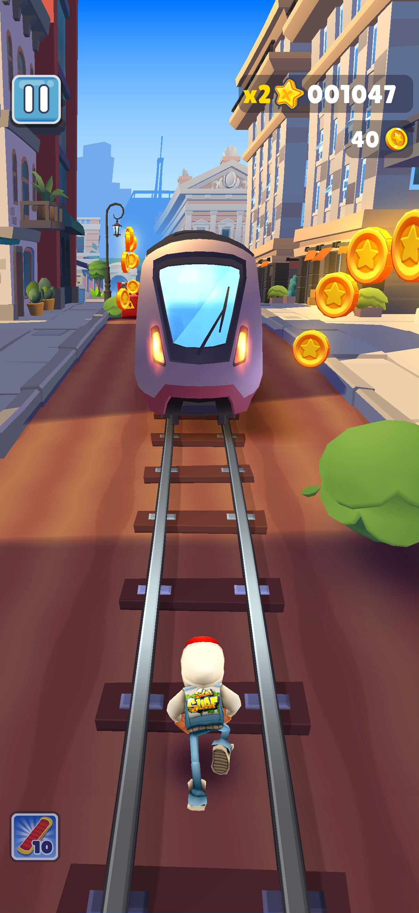
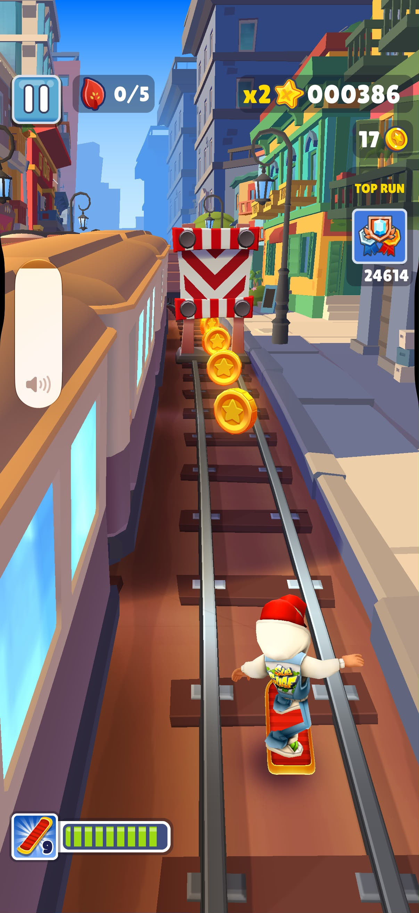
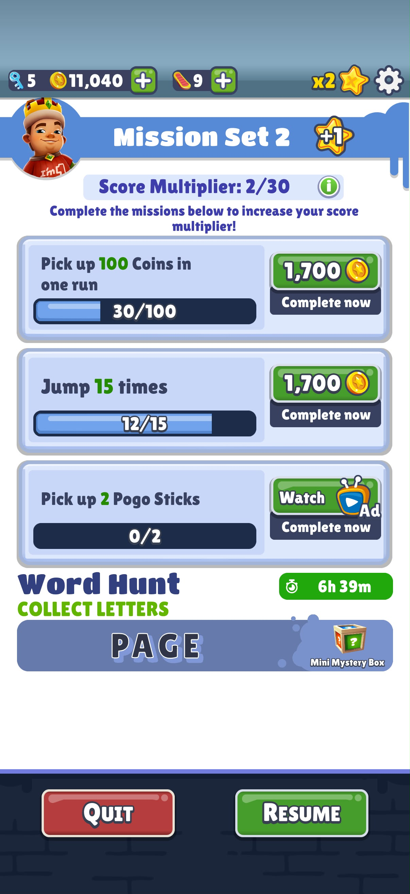

1. M1, M2, M6 · A run in progress: the three lanes, a train and a barrier ahead, a line of coins, and the score.
2. M3 · Riding a hoverboard during a run, with its timer showing.
3. M5 · The missions screen: the current set of three missions and the score multiplier.

| # | Mechanic | Dynamic | Aesthetic | Bartle type |
|---|---|---|---|---|
| M1 | Swiping left or right moves the runner between three lanes; swiping up jumps and swiping down rolls. | Players read the track two or three obstacles ahead and chain swipes, changing lanes early instead of at the last moment. | **Sensation:** every swipe gives an instant, smooth move. | **Achiever:** clean control is how a score grows. |
| M2 | Hitting a train or barrier head-on ends the run, and the run gets faster the longer it lasts. | Players turn careful late in a run, stay on train roofs where less is in the way, and start again straight after a crash. | **Challenge:** any run can be lost, and more easily as it speeds up, so a long run means something. | **Achiever:** the run is a test to beat. |
| M3 | Double-tapping starts a hoverboard that absorbs one crash for 30 seconds. | Players save boards for the fast part of a run, and take riskier lanes while one is active. | **Challenge:** a risk the player chooses when to cover. | **Achiever:** boards protect a score worth keeping. |
| M4 | Mystery boxes picked up on the track open after the run and give a random reward. | Players leave a safe lane to grab a box, and wait at the end of the run to see what it holds. | **Discovery:** nobody knows what is inside until it opens. | **Explorer:** finding out what the game has to give. |
| M5 | Finishing a set of three missions raises the score multiplier for every later run. | Players plan a run around the mission list, such as jumping a set number of times, instead of only running far. | **Challenge:** short goals with a lasting payoff. | **Achiever:** a ladder of mission sets to climb. |
| M6 | Coins collected during runs buy upgrades that make each power-up last longer. | Players steer towards coin lines even when the lane is riskier, and save up for their favourite power-up. | **Submission:** collecting and upgrading is a calm routine, a few minutes at a time. | **Achiever:** upgrades are progress that stays. |
| M7 | The Top Run leaderboard ranks the player's best score against friends and other players. | Players replay to pass the name just above theirs, and check the board after a good run. | **Challenge:** a human score to beat. | **Killer:** moving up means pushing someone else down. |

**Aesthetic profile:** Challenge and Sensation lead: fast swiping (M1) under a rising risk of losing the run (M2, M3, M5). Submission keeps players coming back for a few minutes at a time (M6).

**Player types**

- Primary: Achievers (acting × world), because the player acts on the game itself to beat it on its own terms: a longer run (M2), the next mission set (M5) and the next upgrade (M6).
- Secondary: Killers (acting × players), because the leaderboard (M7) is the one place other people matter, and the only way to use it is to beat their scores.

## Game 2 · Brawl Stars

- **Store link:** https://apps.apple.com/us/app/brawl-stars/id1229016807
- **Genre:** Team-based multiplayer action (3v3 brawler)
- **I played:** About 40 minutes; 120 trophies; 4 brawlers unlocked.

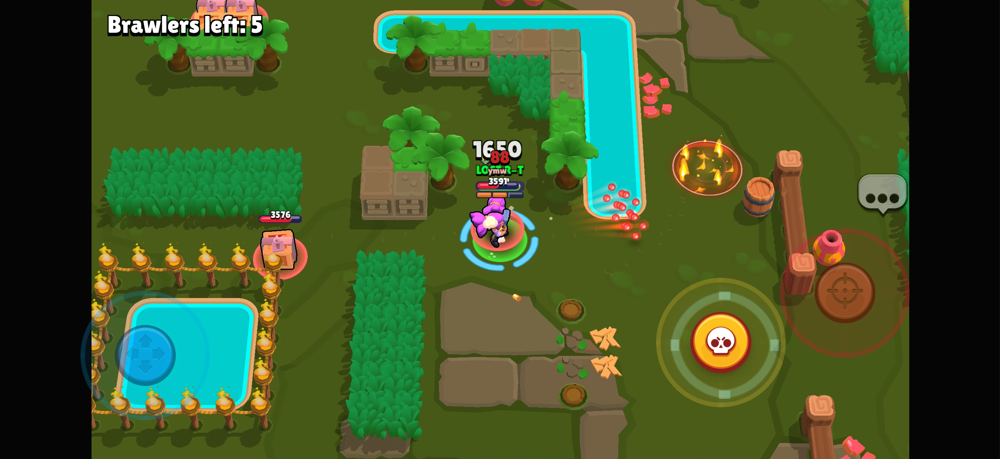
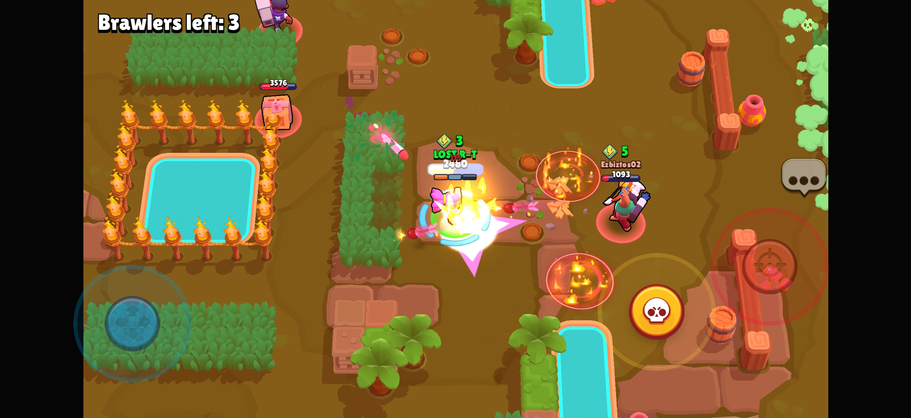
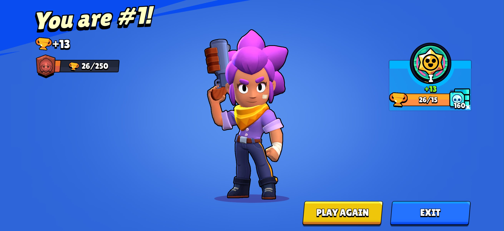

1. M1, M3 · A Gem Grab match in progress: my ammo bars, both teams' gem counts, and the gem mine.
2. M2 · My Super fully charged (or being used) during a match.
3. M6 · The result screen after a match, showing trophies won or lost.

| # | Mechanic | Dynamic | Aesthetic | Bartle type |
|---|---|---|---|---|
| M1 | A brawler holds three ammo bars; each attack uses one, and they refill one at a time. | Players fire in short bursts and step back to reload, and rush an enemy who has just used up their ammo. | **Challenge:** fights are won by timing, not by tapping fastest. | **Killer:** the timing is aimed at beating another player. |
| M2 | Hits that land charge the Super, a stronger ability that can be used once per charge. | Players poke from range to charge it, then hold the Super for a moment that matters, such as the enemy gem carrier. | **Sensation:** the Super is the big, loud hit of the match. | **Killer:** it is saved to take someone out. |
| M3 | In Gem Grab, gems appear from a mine in the middle; a team holding ten starts a 15-second countdown and wins if it still holds ten at the end. A defeated player drops all their gems. | One teammate becomes the carrier and falls back while the other two guard; the losing team rushes the carrier during the countdown. | **Fellowship:** the win depends on three players taking different jobs. | **Socializer:** the mode only works by playing with the team. |
| M4 | A defeated brawler is out of the match for a few seconds before respawning on their own side. | Players with low health pull back behind walls, and teams push forward while the other side is one player short. | **Challenge:** every defeat costs the whole team time and ground. | **Killer:** removing a player is the way to gain ground. |
| M5 | A brawler standing in a bush is hidden from enemies until one comes close or the brawler attacks. | Players wait in bushes to ambush, and others shoot into bushes to check them before walking past. | **Challenge:** hidden information to read and bluff with. | **Killer:** an ambush is something done to another player. |
| M6 | Winning a match adds trophies to the brawler used and losing takes some away; total trophies unlock rewards on the Trophy Road. | Players stay with the brawlers they win with, and stop or switch after a losing streak to protect their trophies. | **Challenge:** a visible number is at stake in every match. | **Achiever:** a ladder with rewards along it. |
| M7 | Coins and Power Points raise a brawler's power level, which increases its health and damage. | Players put their resources into one or two favourites instead of spreading them across all brawlers. | **Expression:** the brawlers a player builds up become their own style of play. | **Achiever:** a level to raise for each brawler. |

**Aesthetic profile:** Challenge and Fellowship lead: short fights decided by timing and reading the other team (M1, M4, M5), won together in team modes (M3). Sensation supports them through the Super (M2).

**Player types**

- Primary: Killers (acting × players), because almost every system is about doing something to another player: out-timing them (M1), saving a Super for them (M2) and ambushing them (M5).
- Secondary: Achievers (acting × world), because between matches the player acts on the game's own ladders: trophies (M6) and power levels (M7).

## Level blockouts

| Level | Screenshot | Its idea | Wayfinding tool |
|---|---|---|---|
| Level01 | 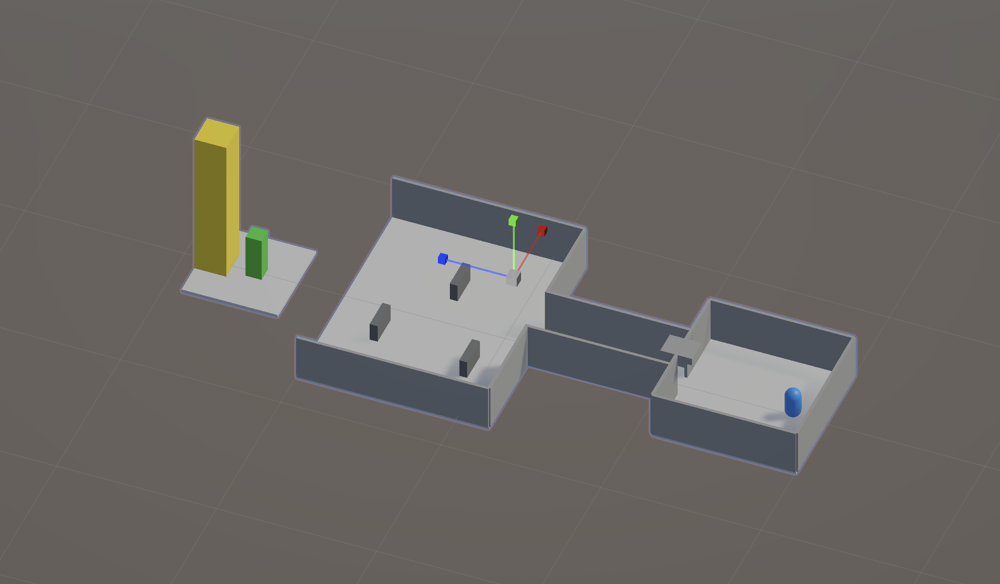 | A spawn room, a corridor and a walled yard with low cover, ending in a 3 m jump gap to the goal. | Landmark: a 10 m yellow tower behind the goal, visible over the walls from the spawn. |
| Level02 | 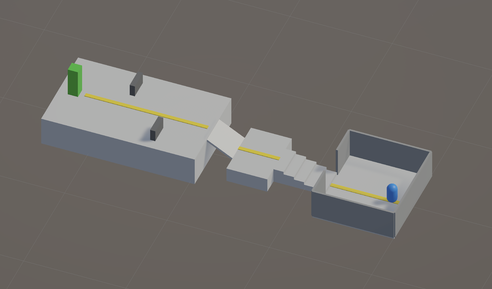 | Height: five steps, a landing and a ramp climb to a deck 3 m up, where the goal stands. | Leading lines: a yellow floor strip runs from the spawn towards the goal. |
| Level03 | 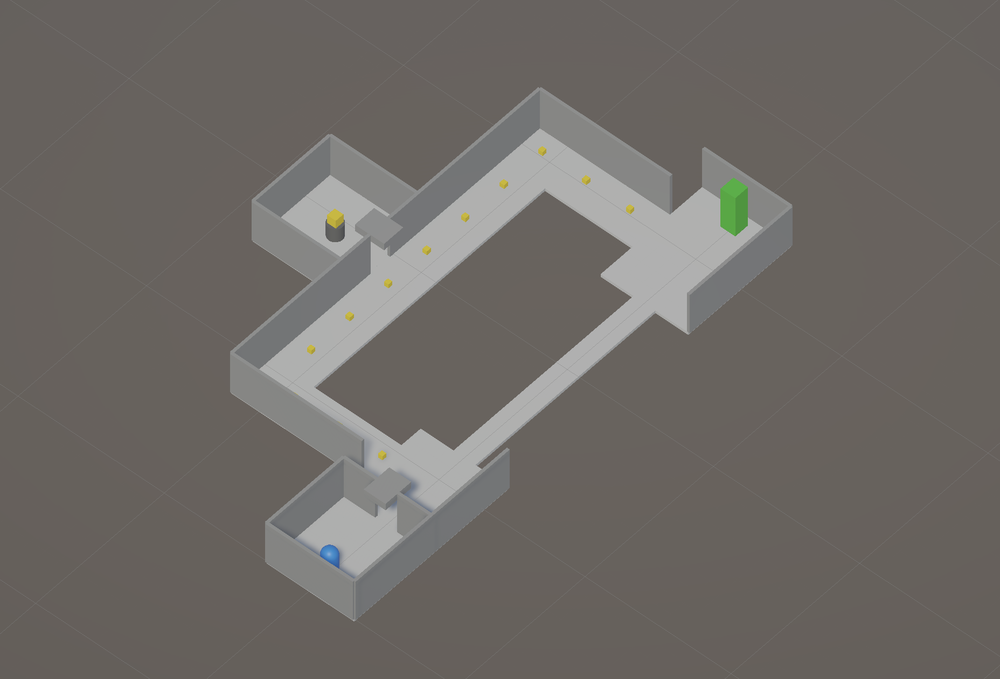 | A split: a short, narrow bridge over a drop, or a longer safe corridor with a reward room on the way. | Breadcrumbs: pickups 3 m apart mark the long route. |
| Level04 | 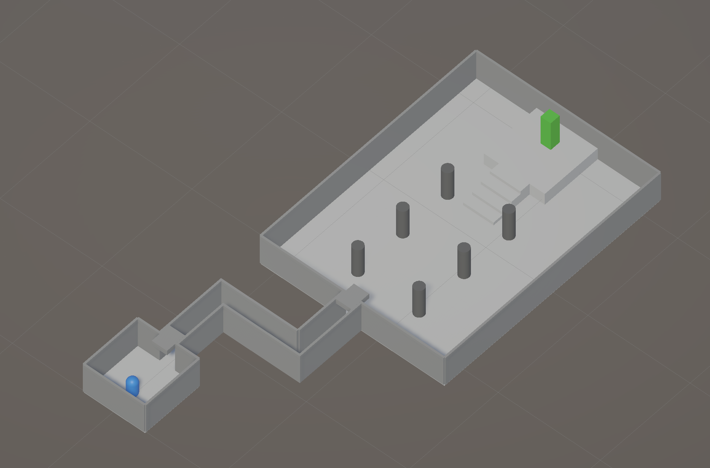 | A squeeze: a bending corridor 1.5 m wide opens into a large pillared hall, with the goal raised on a dais. | Pinch and release: the tight corridor hides the hall until the doorway. |
| Level05 | 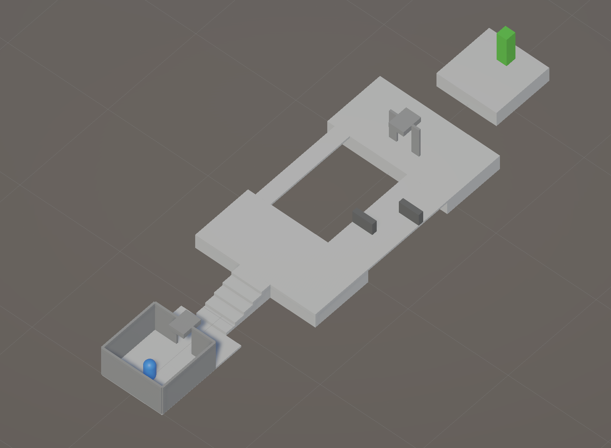 | Combines the earlier ideas: a climb, a split between a narrow bridge and a wide path with cover, then a 3 m gap. | Framing: the goal is seen through the spawn room's doorway, and again through a doorway on the second deck. |
